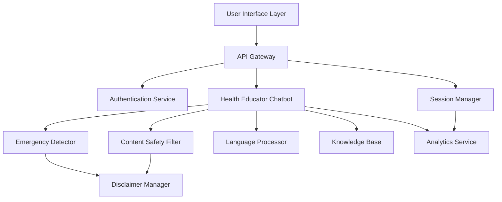
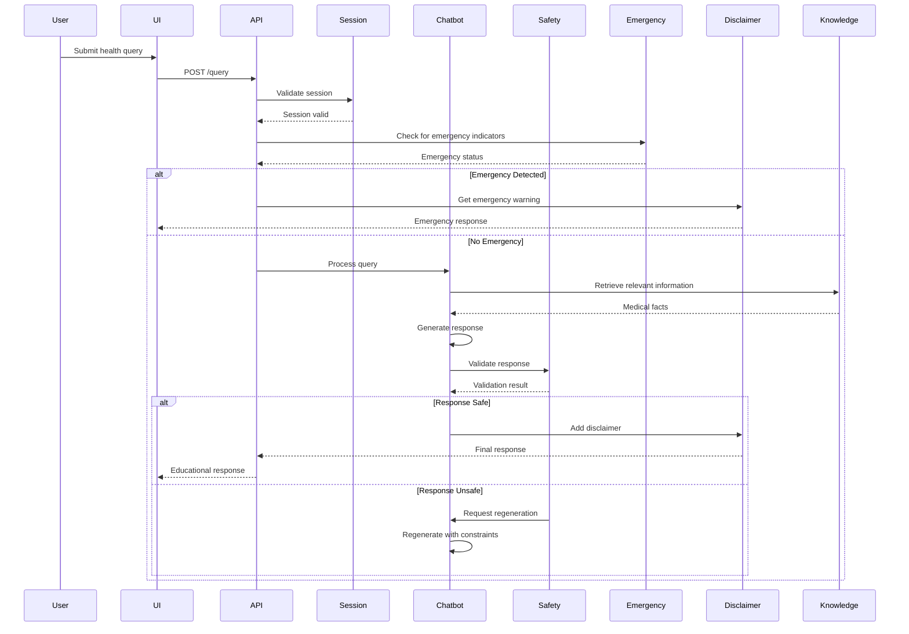

# Design Document: Remote Healthcare Education Application

## Overview

The Remote Healthcare Education Application is a safety-first, AI-powered educational platform that provides reliable health information to underserved communities. The architecture prioritizes user safety through multiple layers of content filtering, mandatory disclaimers, and emergency detection systems. The design emphasizes accessibility, low-bandwidth operation, and multilingual support while maintaining strict boundaries against medical diagnosis or treatment advice.

### Design Principles

1. **Safety First**: Multiple validation layers ensure no harmful medical advice is provided
2. **Educational Only**: Clear separation between education and medical practice
3. **Accessibility**: Support for diverse users including low literacy, disabilities, and limited connectivity
4. **Cultural Sensitivity**: Multilingual support with culturally appropriate content
5. **Privacy by Design**: Minimal data collection with strong encryption and anonymization
6. **Scalability**: Cloud-native architecture supporting growth from hundreds to millions of users

## Architecture

### High-Level Architecture



### Component Architecture

The system follows a microservices architecture with the following key components:

1. **User Interface Layer**: Cross-platform frontend (web and mobile)
2. **API Gateway**: Request routing, rate limiting, and load balancing
3. **Authentication Service**: User identity and session management
4. **Health Educator Chatbot**: Core AI-powered educational engine
5. **Content Safety Filter**: Multi-stage validation of AI responses
6. **Emergency Detector**: Pattern matching for urgent medical situations
7. **Disclaimer Manager**: Context-aware disclaimer injection
8. **Language Processor**: Translation and localization services
9. **Knowledge Base**: Curated medical information repository
10. **Analytics Service**: Usage tracking and quality monitoring

### Data Flow



## Components and Interfaces

### 1. User Interface Layer

**Responsibilities:**
- Render chat interface with accessibility features
- Handle voice input/output (optional)
- Display disclaimers prominently
- Adapt to bandwidth conditions
- Support multiple languages

**Key Interfaces:**

```typescript
interface ChatMessage {
  id: string;
  role: 'user' | 'assistant' | 'system';
  content: string;
  timestamp: Date;
  language: string;
  hasDisclaimer: boolean;
  isEmergency: boolean;
}

interface UIConfig {
  language: string;
  voiceEnabled: boolean;
  textSize: 'small' | 'medium' | 'large';
  highContrast: boolean;
  bandwidthMode: 'full' | 'optimized' | 'minimal';
}

interface ChatInterface {
  sendMessage(content: string): Promise<ChatMessage>;
  getHistory(): ChatMessage[];
  updateConfig(config: Partial<UIConfig>): void;
  acknowledgeDisclaimer(): Promise<boolean>;
}
```

### 2. API Gateway

**Responsibilities:**
- Route requests to appropriate services
- Implement rate limiting (10 requests/minute per user)
- Load balancing across service instances
- Request/response logging
- TLS termination

**Key Interfaces:**

```typescript
interface APIRequest {
  endpoint: string;
  method: 'GET' | 'POST' | 'PUT' | 'DELETE';
  headers: Record<string, string>;
  body?: any;
  userId?: string;
  sessionId?: string;
}

interface APIResponse {
  statusCode: number;
  body: any;
  headers: Record<string, string>;
}

interface RateLimitConfig {
  maxRequests: number;
  windowSeconds: number;
  blockDurationSeconds: number;
}
```

### 3. Health Educator Chatbot

**Responsibilities:**
- Process user health queries
- Generate educational responses using LLM
- Maintain conversation context
- Interface with knowledge base
- Apply response templates for consistency

**Key Interfaces:**

```typescript
interface HealthQuery {
  text: string;
  language: string;
  sessionId: string;
  conversationHistory: ChatMessage[];
}

interface EducationalResponse {
  content: string;
  sources: string[];
  confidence: number;
  requiresDisclaimer: boolean;
  suggestedFollowUps: string[];
}

interface ChatbotEngine {
  processQuery(query: HealthQuery): Promise<EducationalResponse>;
  regenerateWithConstraints(query: HealthQuery, constraints: string[]): Promise<EducationalResponse>;
  getConversationContext(sessionId: string): ChatMessage[];
}

interface LLMConfig {
  model: string;
  temperature: number;
  maxTokens: number;
  systemPrompt: string;
  safetySettings: SafetySettings;
}

interface SafetySettings {
  blockDiagnosis: boolean;
  blockPrescriptions: boolean;
  blockTreatmentAdvice: boolean;
  requireSourceCitation: boolean;
}
```

### 4. Content Safety Filter

**Responsibilities:**
- Validate AI responses against safety rules
- Detect diagnosis, prescription, or treatment advice
- Check for bias or inappropriate content
- Enforce simple language requirements
- Log violations for review

**Key Interfaces:**

```typescript
interface SafetyValidation {
  isValid: boolean;
  violations: SafetyViolation[];
  confidence: number;
  suggestedFixes: string[];
}

interface SafetyViolation {
  type: 'diagnosis' | 'prescription' | 'treatment' | 'bias' | 'complexity' | 'harmful';
  severity: 'low' | 'medium' | 'high' | 'critical';
  description: string;
  location: string;
}

interface SafetyFilter {
  validateResponse(response: string, query: string): Promise<SafetyValidation>;
  checkForDiagnosis(text: string): boolean;
  checkForPrescription(text: string): boolean;
  checkForTreatmentAdvice(text: string): boolean;
  checkLanguageComplexity(text: string): number;
}

interface SafetyRules {
  prohibitedPhrases: string[];
  diagnosticPatterns: RegExp[];
  prescriptionPatterns: RegExp[];
  treatmentPatterns: RegExp[];
  maxReadingLevel: number;
}
```

### 5. Emergency Detector

**Responsibilities:**
- Scan queries for emergency indicators
- Prioritize emergency warnings
- Log emergency interactions
- Provide appropriate emergency guidance

**Key Interfaces:**

```typescript
interface EmergencyCheck {
  isEmergency: boolean;
  indicators: EmergencyIndicator[];
  urgencyLevel: 'immediate' | 'urgent' | 'soon';
  recommendedAction: string;
}

interface EmergencyIndicator {
  keyword: string;
  category: 'cardiac' | 'respiratory' | 'neurological' | 'trauma' | 'other';
  confidence: number;
}

interface EmergencyDetector {
  checkForEmergency(query: string): EmergencyCheck;
  getEmergencyResponse(check: EmergencyCheck, language: string): string;
  logEmergencyInteraction(sessionId: string, check: EmergencyCheck): void;
}

interface EmergencyPatterns {
  keywords: string[];
  phrases: string[];
  categories: Record<string, string[]>;
}
```

### 6. Disclaimer Manager

**Responsibilities:**
- Generate context-appropriate disclaimers
- Track disclaimer acknowledgments
- Inject disclaimers into responses
- Provide emergency-specific disclaimers

**Key Interfaces:**

```typescript
interface DisclaimerConfig {
  type: 'initial' | 'session' | 'inline' | 'emergency';
  language: string;
  context?: string;
}

interface Disclaimer {
  text: string;
  requiresAcknowledgment: boolean;
  displayDuration?: number;
  priority: 'low' | 'medium' | 'high' | 'critical';
}

interface DisclaimerManager {
  getDisclaimer(config: DisclaimerConfig): Disclaimer;
  recordAcknowledgment(userId: string, disclaimerType: string): Promise<void>;
  hasAcknowledged(userId: string, disclaimerType: string): Promise<boolean>;
  injectDisclaimer(response: string, disclaimerType: string, language: string): string;
}
```

### 7. Language Processor

**Responsibilities:**
- Translate content between supported languages
- Maintain medical terminology accuracy
- Provide localized content
- Handle text-to-speech and speech-to-text

**Key Interfaces:**

```typescript
interface TranslationRequest {
  text: string;
  sourceLanguage: string;
  targetLanguage: string;
  preserveMedicalTerms: boolean;
}

interface TranslationResult {
  translatedText: string;
  confidence: number;
  preservedTerms: Record<string, string>;
  warnings: string[];
}

interface LanguageProcessor {
  translate(request: TranslationRequest): Promise<TranslationResult>;
  getSupportedLanguages(): string[];
  textToSpeech(text: string, language: string): Promise<AudioBuffer>;
  speechToText(audio: AudioBuffer, language: string): Promise<string>;
}

interface VoiceConfig {
  language: string;
  voice: string;
  speed: number;
  pitch: number;
}
```

### 8. Session Manager

**Responsibilities:**
- Create and maintain user sessions
- Store conversation context
- Handle session expiration
- Manage session security

**Key Interfaces:**

```typescript
interface Session {
  id: string;
  userId?: string;
  createdAt: Date;
  lastActivityAt: Date;
  expiresAt: Date;
  conversationHistory: ChatMessage[];
  preferences: UIConfig;
  disclaimerAcknowledged: boolean;
}

interface SessionManager {
  createSession(userId?: string): Promise<Session>;
  getSession(sessionId: string): Promise<Session | null>;
  updateSession(sessionId: string, updates: Partial<Session>): Promise<void>;
  extendSession(sessionId: string): Promise<void>;
  endSession(sessionId: string): Promise<void>;
  cleanupExpiredSessions(): Promise<number>;
}
```

### 9. Knowledge Base

**Responsibilities:**
- Store curated medical information
- Provide fact retrieval for chatbot
- Support semantic search
- Track information sources
- Enable periodic content updates

**Key Interfaces:**

```typescript
interface MedicalFact {
  id: string;
  topic: string;
  content: string;
  sources: string[];
  lastReviewed: Date;
  reviewedBy: string;
  language: string;
  tags: string[];
}

interface HealthMyth {
  id: string;
  myth: string;
  fact: string;
  explanation: string;
  sources: string[];
  culturalContext?: string;
}

interface KnowledgeBase {
  searchFacts(query: string, language: string): Promise<MedicalFact[]>;
  getMyth(mythText: string): Promise<HealthMyth | null>;
  getPreventiveCareInfo(category: string, ageGroup: string): Promise<MedicalFact[]>;
  updateFact(factId: string, updates: Partial<MedicalFact>): Promise<void>;
}
```

### 10. Analytics Service

**Responsibilities:**
- Track usage metrics
- Monitor response quality
- Collect user feedback
- Generate reports for healthcare advisors
- Identify knowledge gaps

**Key Interfaces:**

```typescript
interface QueryMetrics {
  sessionId: string;
  queryText: string;
  responseTime: number;
  emergencyDetected: boolean;
  safetyViolations: number;
  userFeedback?: 'positive' | 'negative' | 'neutral';
  language: string;
  timestamp: Date;
}

interface QualityMetrics {
  averageResponseTime: number;
  safetyViolationRate: number;
  emergencyDetectionRate: number;
  userSatisfactionScore: number;
  topQueries: string[];
  knowledgeGaps: string[];
}

interface AnalyticsService {
  logQuery(metrics: QueryMetrics): Promise<void>;
  getQualityMetrics(startDate: Date, endDate: Date): Promise<QualityMetrics>;
  flagForReview(sessionId: string, reason: string): Promise<void>;
  getUserFeedback(sessionId: string): Promise<string | null>;
}
```

## Data Models

### User Session Model

```typescript
interface UserSession {
  sessionId: string;
  userId?: string; // Optional for anonymous users
  createdAt: Date;
  lastActivityAt: Date;
  expiresAt: Date;
  language: string;
  disclaimerAcknowledged: boolean;
  conversationHistory: ConversationMessage[];
  preferences: UserPreferences;
}

interface ConversationMessage {
  messageId: string;
  role: 'user' | 'assistant' | 'system';
  content: string;
  timestamp: Date;
  metadata: MessageMetadata;
}

interface MessageMetadata {
  hasDisclaimer: boolean;
  isEmergency: boolean;
  safetyChecked: boolean;
  sources?: string[];
  responseTime?: number;
}

interface UserPreferences {
  language: string;
  voiceEnabled: boolean;
  textSize: 'small' | 'medium' | 'large';
  highContrast: boolean;
  bandwidthMode: 'full' | 'optimized' | 'minimal';
}
```

### Knowledge Base Models

```typescript
interface MedicalContent {
  contentId: string;
  type: 'fact' | 'myth' | 'preventive' | 'symptom' | 'emergency';
  topic: string;
  title: string;
  content: string;
  simplifiedContent: string; // For low literacy users
  sources: Source[];
  tags: string[];
  language: string;
  lastReviewed: Date;
  reviewedBy: string;
  qualityScore: number;
}

interface Source {
  title: string;
  url: string;
  type: 'peer-reviewed' | 'government' | 'medical-institution' | 'other';
  publicationDate?: Date;
}

interface HealthMythEntry {
  mythId: string;
  mythStatement: string;
  factualCorrection: string;
  explanation: string;
  sources: Source[];
  culturalContext?: string;
  prevalence: 'common' | 'regional' | 'rare';
  harmLevel: 'low' | 'medium' | 'high';
}
```

### Safety and Compliance Models

```typescript
interface SafetyLog {
  logId: string;
  sessionId: string;
  timestamp: Date;
  violationType: 'diagnosis' | 'prescription' | 'treatment' | 'bias' | 'harmful';
  severity: 'low' | 'medium' | 'high' | 'critical';
  originalQuery: string;
  generatedResponse: string;
  action: 'blocked' | 'regenerated' | 'modified' | 'allowed-with-warning';
  reviewStatus: 'pending' | 'reviewed' | 'resolved';
}

interface EmergencyLog {
  logId: string;
  sessionId: string;
  timestamp: Date;
  queryText: string;
  detectedIndicators: string[];
  urgencyLevel: 'immediate' | 'urgent' | 'soon';
  responseProvided: string;
  userAction?: 'acknowledged' | 'dismissed' | 'unknown';
}

interface DisclaimerAcknowledgment {
  userId: string;
  sessionId: string;
  disclaimerType: 'initial' | 'session' | 'inline' | 'emergency';
  acknowledgedAt: Date;
  ipAddress: string;
  userAgent: string;
}
```

### Analytics Models

```typescript
interface UsageMetrics {
  metricId: string;
  date: Date;
  totalSessions: number;
  totalQueries: number;
  uniqueUsers: number;
  averageSessionDuration: number;
  languageDistribution: Record<string, number>;
  topTopics: string[];
  emergencyDetections: number;
  safetyViolations: number;
}

interface FeedbackEntry {
  feedbackId: string;
  sessionId: string;
  messageId: string;
  rating: 'positive' | 'negative' | 'neutral';
  comment?: string;
  timestamp: Date;
  category?: 'accuracy' | 'clarity' | 'helpfulness' | 'safety' | 'other';
}
```


## Correctness Properties

*A property is a characteristic or behavior that should hold true across all valid executions of a system—essentially, a formal statement about what the system should do. Properties serve as the bridge between human-readable specifications and machine-verifiable correctness guarantees.*

### Response Generation Properties

**Property 1: Response Time Performance**
*For any* health query submitted by a user, the system should provide an educational response within 5 seconds under normal load conditions.
**Validates: Requirements 1.1, 15.5**

**Property 2: Language Simplicity**
*For any* generated response, the reading level should not exceed grade 8 (Flesch-Kincaid scale), ensuring accessibility for diverse literacy levels.
**Validates: Requirements 1.2**

**Property 3: No Medical Advice**
*For any* generated response, the content should not contain medical diagnosis statements, prescription recommendations, or treatment decisions.
**Validates: Requirements 1.3**

**Property 4: Context Preservation**
*For any* session with multiple queries, when a user asks follow-up questions, the system should reference and maintain context from previous queries in that session.
**Validates: Requirements 1.4, 14.1**

**Property 5: Source Citation**
*For any* educational response, the content should be traceable to verified medical knowledge sources in the knowledge base.
**Validates: Requirements 1.5**

### Safety Filter Properties

**Property 6: Universal Safety Validation**
*For any* response generated by the Health Educator, the Content Safety Filter should validate it against safety guidelines before delivery to the user.
**Validates: Requirements 2.1**

**Property 7: Medical Advice Request Declination**
*For any* query requesting diagnosis, prescription, or treatment advice, the system should decline the request and explain its educational-only nature while recommending professional consultation.
**Validates: Requirements 2.2, 2.3, 2.4**

**Property 8: Harmful Content Blocking**
*For any* response that the Content Filter identifies as potentially harmful, the system should block the response and provide a safe alternative instead.
**Validates: Requirements 2.5**

**Property 9: Bias Prevention**
*For any* generated response, the content should not contain biased language based on race, gender, age, or socioeconomic status.
**Validates: Requirements 2.6**

### Disclaimer Properties

**Property 10: Session Disclaimer Display**
*For any* new session started by a user, the system should display a disclaimer reminder before providing health information.
**Validates: Requirements 3.2**

**Property 11: Inline Disclaimer Injection**
*For any* health information response, the Disclaimer Manager should include an inline disclaimer stating the information is educational only.
**Validates: Requirements 3.3**

**Property 12: Disclaimer Content Completeness**
*For any* disclaimer displayed, the text should clearly state that the system does not diagnose, prescribe, or replace medical professionals.
**Validates: Requirements 3.4**

### Emergency Detection Properties

**Property 13: Emergency Warning Display**
*For any* health query containing emergency indicators (chest pain, difficulty breathing, severe bleeding, loss of consciousness, stroke symptoms), the system should immediately display an urgent care warning.
**Validates: Requirements 4.1**

**Property 14: Emergency Warning Priority**
*For any* response where an emergency warning is triggered, the warning should appear before all other response content.
**Validates: Requirements 4.2**

**Property 15: Emergency Guidance Completeness**
*For any* emergency warning displayed, the content should include clear guidance to seek immediate medical attention or call emergency services.
**Validates: Requirements 4.3**

**Property 16: Emergency Interaction Logging**
*For any* emergency warning displayed, the system should create a log entry for safety monitoring purposes.
**Validates: Requirements 4.5**

### Symptom Education Properties

**Property 17: Non-Diagnostic Symptom Information**
*For any* query about symptoms, the response should provide educational information about possible causes without providing a diagnosis.
**Validates: Requirements 5.1**

**Property 18: Symptom Response Completeness**
*For any* symptom education response, the content should include warning signs for professional consultation, emphasis on professional diagnosis, information about duration and severity indicators, and guidance on documenting symptoms.
**Validates: Requirements 5.2, 5.3, 5.4, 5.5**

### Preventive Care Properties

**Property 19: Evidence-Based Preventive Guidance**
*For any* preventive care information response, the content should be evidence-based and cite reliable medical sources.
**Validates: Requirements 6.1**

**Property 20: Age-Appropriate Screening Recommendations**
*For any* request for health screening information with a specified age group, the recommendations should be appropriate for that age group.
**Validates: Requirements 6.2**

**Property 21: Provider Consultation Encouragement**
*For any* preventive care guidance response, the content should encourage users to discuss recommendations with their healthcare providers.
**Validates: Requirements 6.5**

### Health Myth Properties

**Property 22: Myth Identification and Correction**
*For any* query about a known health myth in the knowledge base, the system should identify it as a myth and provide factual correction.
**Validates: Requirements 7.1**

**Property 23: Myth Correction Source Citation**
*For any* myth correction response, the content should cite reliable medical sources or explain the scientific basis for the correction.
**Validates: Requirements 7.2**

**Property 24: Myth Harm Explanation**
*For any* myth correction response, the content should explain why the myth is harmful or misleading.
**Validates: Requirements 7.4**

### Multilingual Properties

**Property 25: Language Consistency**
*For any* session where a user selects a language preference, all content provided should be in that selected language.
**Validates: Requirements 8.1**

**Property 26: Medical Term Preservation**
*For any* translated content, medical terminology should maintain accuracy, and when translation is uncertain, the original term should be provided with explanation.
**Validates: Requirements 8.3, 8.4**

**Property 27: Language Switching**
*For any* session, when a user changes language preference, all subsequent content should be provided in the new language.
**Validates: Requirements 8.5**

### Low-Bandwidth Properties

**Property 28: Low-Bandwidth Response Time**
*For any* query submitted on a low-bandwidth connection, the system should deliver text-based responses within 10 seconds.
**Validates: Requirements 9.1**

**Property 29: Data Compression**
*For any* response transmitted, the data should be compressed to minimize bandwidth usage.
**Validates: Requirements 9.2**

**Property 30: Content Prioritization in Low-Bandwidth Mode**
*For any* response in low-bandwidth mode, essential text content should be prioritized over optional media elements.
**Validates: Requirements 9.3**

**Property 31: 2G Functionality**
*For any* query submitted on a 2G-speed connection in text-only mode, the system should remain functional and deliver responses.
**Validates: Requirements 9.4**

**Property 32: Connection Degradation Resilience**
*For any* session where connection quality degrades, the system should preserve user data and session context without loss.
**Validates: Requirements 9.5**

### Voice Interaction Properties

**Property 33: Speech-to-Text Processing**
*For any* voice-enabled session, when a user speaks a health query, the system should convert speech to text and process the query.
**Validates: Requirements 10.1**

**Property 34: Text-to-Speech Output**
*For any* voice-enabled session, when a response is generated, the system should provide text-to-speech audio output.
**Validates: Requirements 10.2**

**Property 35: Multilingual Voice Support**
*For any* voice-enabled session, the system should support voice input in all supported text languages.
**Validates: Requirements 10.3**

**Property 36: Low-Confidence Speech Clarification**
*For any* voice input with low speech recognition confidence, the system should request clarification from the user.
**Validates: Requirements 10.4**

**Property 37: Voice-Text Mode Switching**
*For any* voice-enabled session, users should be able to switch between voice and text input modes without losing session context.
**Validates: Requirements 10.5**

### Privacy and Security Properties

**Property 38: Encryption in Transit**
*For any* health query or response transmitted, the data should be encrypted using TLS 1.3 or higher.
**Validates: Requirements 11.1**

**Property 39: PII Storage Restriction**
*For any* user interaction, personally identifiable information should not be stored unless the user has explicitly provided consent.
**Validates: Requirements 11.2**

**Property 40: Data Anonymization**
*For any* conversation log stored for quality improvement, all user data should be anonymized before storage.
**Validates: Requirements 11.3**

### Accessibility Properties

**Property 41: Screen Reader Compatibility**
*For any* UI element, proper ARIA labels and semantic HTML should be present to support screen readers.
**Validates: Requirements 12.2**

**Property 42: Keyboard Navigation**
*For any* interactive element in the UI, it should be navigable and operable using keyboard alone.
**Validates: Requirements 12.4**

**Property 43: Alternative Text Presence**
*For any* image or visual content displayed, alternative text should be provided.
**Validates: Requirements 12.5**

### Quality Assurance Properties

**Property 44: Peer-Reviewed Source Grounding**
*For any* educational response, the information should be traceable to peer-reviewed medical sources in the knowledge base.
**Validates: Requirements 13.1**

**Property 45: Uncertainty Acknowledgment**
*For any* query where the system has low confidence in information accuracy, the response should acknowledge uncertainty and recommend professional consultation.
**Validates: Requirements 13.3**

**Property 46: Quality Metrics Tracking**
*For any* response provided, quality metrics including user feedback should be tracked in the analytics system.
**Validates: Requirements 13.4**

**Property 47: Negative Feedback Flagging**
*For any* response that receives negative user feedback, the system should flag it for expert review.
**Validates: Requirements 13.5**

### Session Management Properties

**Property 48: Session Timeout Maintenance**
*For any* session with up to 30 minutes of inactivity, the system should maintain session context and conversation history.
**Validates: Requirements 14.2**

**Property 49: Post-Expiration Context Isolation**
*For any* user returning after session expiration, the new session should start fresh without access to previous session context.
**Validates: Requirements 14.5**

### Error Handling Properties

**Property 50: Error Logging and User Protection**
*For any* system error that occurs, the system should log the error for administrators while displaying user-friendly messages without technical details to users.
**Validates: Requirements 15.4**


## Error Handling

### Error Categories

The system implements comprehensive error handling across multiple categories:

#### 1. User Input Errors

**Invalid Query Format:**
- **Detection**: Query validation at API gateway
- **Response**: Friendly message asking user to rephrase
- **Logging**: Log invalid format patterns for improvement
- **Example**: Empty queries, excessively long queries (>1000 characters)

**Inappropriate Content Requests:**
- **Detection**: Content Safety Filter identifies diagnosis/prescription/treatment requests
- **Response**: Polite declination with explanation of educational-only nature
- **Logging**: Track frequency of inappropriate requests
- **Example**: "What medication should I take for my headache?"

**Emergency Indicators:**
- **Detection**: Emergency Detector identifies urgent keywords
- **Response**: Immediate emergency warning with guidance to seek care
- **Logging**: High-priority logging for safety monitoring
- **Example**: "I'm having severe chest pain"

#### 2. System Errors

**LLM Service Failures:**
- **Detection**: Timeout or error response from LLM API
- **Response**: "I'm having trouble processing your question right now. Please try again in a moment."
- **Fallback**: Retry with exponential backoff (3 attempts)
- **Logging**: Alert administrators for persistent failures
- **User Impact**: Graceful degradation without exposing technical details

**Knowledge Base Unavailability:**
- **Detection**: Database connection failure or query timeout
- **Response**: "I'm unable to access health information right now. Please try again shortly."
- **Fallback**: Use cached frequently-accessed content if available
- **Logging**: Critical alert to administrators
- **User Impact**: Temporary service degradation

**Translation Service Failures:**
- **Detection**: Translation API timeout or error
- **Response**: Offer to continue in English or retry
- **Fallback**: Display content in English with apology
- **Logging**: Track translation failures by language
- **User Impact**: Language fallback to English

#### 3. Safety Violations

**Harmful Content Generation:**
- **Detection**: Content Safety Filter identifies potential harm
- **Response**: Block response, regenerate with stricter constraints
- **Fallback**: If regeneration fails, provide generic safe response
- **Logging**: Critical logging with full context for review
- **User Impact**: May receive more generic response

**Bias Detection:**
- **Detection**: Bias detection patterns in Safety Filter
- **Response**: Regenerate response with bias mitigation
- **Fallback**: Provide neutral educational content
- **Logging**: Track bias patterns for model improvement
- **User Impact**: Slight delay in response

**Medical Advice Leakage:**
- **Detection**: Safety Filter identifies diagnosis/prescription language
- **Response**: Block response, regenerate with educational framing
- **Fallback**: Provide general educational content on topic
- **Logging**: High-priority logging for safety review
- **User Impact**: More general educational response

#### 4. Performance Errors

**Response Timeout:**
- **Detection**: Response generation exceeds 5-second threshold
- **Response**: "This is taking longer than expected. Please wait..."
- **Fallback**: Extended timeout to 10 seconds, then return partial response
- **Logging**: Track slow queries for optimization
- **User Impact**: Delayed response with progress indicator

**Rate Limit Exceeded:**
- **Detection**: User exceeds 10 requests per minute
- **Response**: "You're asking questions too quickly. Please wait a moment."
- **Fallback**: Queue request for processing after cooldown
- **Logging**: Track rate limit violations
- **User Impact**: Temporary request blocking

**High System Load:**
- **Detection**: System metrics exceed capacity thresholds
- **Response**: Maintain service with slightly degraded performance
- **Fallback**: Auto-scaling triggers additional resources
- **Logging**: Alert administrators of scaling events
- **User Impact**: Slightly slower responses

#### 5. Session Errors

**Session Expiration:**
- **Detection**: Session inactive for >30 minutes
- **Response**: "Your session has expired. Would you like to start a new conversation?"
- **Fallback**: Create new session automatically
- **Logging**: Track session duration patterns
- **User Impact**: Loss of conversation context

**Session Data Corruption:**
- **Detection**: Unable to deserialize session data
- **Response**: "We encountered an issue with your session. Starting fresh."
- **Fallback**: Create new clean session
- **Logging**: Critical alert for data integrity issues
- **User Impact**: Loss of conversation context

#### 6. Network Errors

**Connection Loss:**
- **Detection**: Client disconnection during request
- **Response**: Client-side retry with exponential backoff
- **Fallback**: Queue request for retry when connection restored
- **Logging**: Track connection stability patterns
- **User Impact**: Automatic retry, minimal disruption

**Low Bandwidth Degradation:**
- **Detection**: Slow response times on client side
- **Response**: Automatically switch to low-bandwidth mode
- **Fallback**: Text-only responses, compressed data
- **Logging**: Track bandwidth patterns by region
- **User Impact**: Reduced media content, faster text delivery

### Error Response Format

All error responses follow a consistent structure:

```typescript
interface ErrorResponse {
  error: {
    code: string;
    message: string; // User-friendly message
    userAction?: string; // Suggested action for user
    retryable: boolean;
    timestamp: Date;
  };
  requestId: string; // For support tracking
}
```

### Error Recovery Strategies

1. **Automatic Retry**: For transient failures (network, timeouts)
2. **Graceful Degradation**: Reduce functionality rather than fail completely
3. **Fallback Content**: Use cached or generic content when primary sources fail
4. **User Notification**: Clear, non-technical explanations of issues
5. **Silent Recovery**: Fix issues without user awareness when possible
6. **Escalation**: Alert administrators for critical or persistent failures

## Testing Strategy

### Overview

The testing strategy employs a dual approach combining property-based testing for universal correctness properties and unit testing for specific examples, edge cases, and integration points. This comprehensive approach ensures both broad coverage through randomized testing and targeted validation of critical scenarios.

### Property-Based Testing

**Framework Selection:**
- **JavaScript/TypeScript**: fast-check
- **Python**: Hypothesis
- **Rationale**: Mature libraries with strong community support and extensive generator capabilities

**Configuration:**
- **Minimum Iterations**: 100 runs per property test
- **Seed Management**: Fixed seeds for reproducible failures
- **Shrinking**: Automatic minimal failing case identification
- **Timeout**: 30 seconds per property test

**Property Test Organization:**

Each correctness property from the design document must be implemented as a property-based test with the following tag format:

```typescript
// Feature: remote-healthcare-education, Property 1: Response Time Performance
test('Response time under 5 seconds for all queries', async () => {
  await fc.assert(
    fc.asyncProperty(
      fc.string({ minLength: 10, maxLength: 500 }), // Random health queries
      async (query) => {
        const startTime = Date.now();
        const response = await healthEducator.processQuery({ text: query, language: 'en' });
        const duration = Date.now() - startTime;
        expect(duration).toBeLessThan(5000);
      }
    ),
    { numRuns: 100 }
  );
});
```

**Generator Strategy:**

Custom generators will be created for domain-specific data:

```typescript
// Health query generator
const healthQueryGen = fc.oneof(
  fc.constant('symptom queries').chain(() => generateSymptomQuery()),
  fc.constant('preventive care').chain(() => generatePreventiveCareQuery()),
  fc.constant('myth questions').chain(() => generateMythQuery()),
  fc.constant('emergency indicators').chain(() => generateEmergencyQuery())
);

// Session context generator
const sessionContextGen = fc.record({
  sessionId: fc.uuid(),
  conversationHistory: fc.array(messageGen, { maxLength: 10 }),
  language: fc.constantFrom('en', 'es', 'hi', 'zh', 'ar', 'pt'),
  preferences: userPreferencesGen
});

// Medical content generator
const medicalContentGen = fc.record({
  topic: fc.constantFrom('diabetes', 'hypertension', 'nutrition', 'exercise'),
  content: fc.string({ minLength: 100, maxLength: 1000 }),
  sources: fc.array(sourceGen, { minLength: 1, maxLength: 5 })
});
```

**Property Test Coverage:**

All 50 correctness properties must have corresponding property-based tests:

- **Response Generation**: Properties 1-5 (5 tests)
- **Safety Filtering**: Properties 6-9 (4 tests)
- **Disclaimers**: Properties 10-12 (3 tests)
- **Emergency Detection**: Properties 13-16 (4 tests)
- **Symptom Education**: Properties 17-18 (2 tests)
- **Preventive Care**: Properties 19-21 (3 tests)
- **Health Myths**: Properties 22-24 (3 tests)
- **Multilingual**: Properties 25-27 (3 tests)
- **Low-Bandwidth**: Properties 28-32 (5 tests)
- **Voice Interaction**: Properties 33-37 (5 tests)
- **Privacy/Security**: Properties 38-40 (3 tests)
- **Accessibility**: Properties 41-43 (3 tests)
- **Quality Assurance**: Properties 44-47 (4 tests)
- **Session Management**: Properties 48-49 (2 tests)
- **Error Handling**: Property 50 (1 test)

**Total**: 50 property-based tests

### Unit Testing

**Framework Selection:**
- **JavaScript/TypeScript**: Jest or Vitest
- **Python**: pytest
- **Rationale**: Industry-standard frameworks with excellent tooling

**Unit Test Focus Areas:**

1. **Specific Examples**:
   - Initial disclaimer display on first launch (Requirement 3.1)
   - Specific emergency keywords detection (Requirement 4.4)
   - Vaccination schedule information availability (Requirement 6.3)
   - Nutrition and lifestyle guidance availability (Requirement 6.4)
   - Minimum 5 language support verification (Requirement 8.2)
   - Text size and contrast options existence (Requirement 12.3)
   - Session expiration notification (Requirement 14.3)
   - Explicit session termination (Requirement 14.4)
   - Data deletion within 30 days (Requirement 11.5)

2. **Edge Cases**:
   - Empty query handling
   - Extremely long queries (>1000 characters)
   - Special characters in queries
   - Malformed session data
   - Concurrent session access
   - Rapid language switching
   - Network interruption during response generation

3. **Integration Points**:
   - API Gateway to Chatbot communication
   - Chatbot to Safety Filter pipeline
   - Safety Filter to Disclaimer Manager flow
   - Emergency Detector to Disclaimer Manager integration
   - Knowledge Base query performance
   - Translation service integration
   - Analytics service data flow

4. **Component Isolation**:
   - Mock LLM responses for consistent testing
   - Mock knowledge base for controlled data
   - Mock translation service for language testing
   - Mock analytics service for tracking verification

**Unit Test Examples:**

```typescript
describe('Disclaimer Manager', () => {
  test('displays initial disclaimer on first launch', async () => {
    const user = createNewUser();
    const disclaimer = await disclaimerManager.getDisclaimer({
      type: 'initial',
      language: 'en'
    });
    
    expect(disclaimer.requiresAcknowledgment).toBe(true);
    expect(disclaimer.text).toContain('does not diagnose');
    expect(disclaimer.text).toContain('does not prescribe');
    expect(disclaimer.text).toContain('does not replace medical professionals');
  });

  test('prevents access without disclaimer acknowledgment', async () => {
    const session = await createSession();
    
    await expect(
      healthEducator.processQuery({ text: 'What is diabetes?', sessionId: session.id })
    ).rejects.toThrow('Disclaimer must be acknowledged');
  });
});

describe('Emergency Detector', () => {
  test('detects chest pain as emergency', () => {
    const check = emergencyDetector.checkForEmergency('I have severe chest pain');
    
    expect(check.isEmergency).toBe(true);
    expect(check.urgencyLevel).toBe('immediate');
    expect(check.indicators).toContainEqual(
      expect.objectContaining({ category: 'cardiac' })
    );
  });

  test('detects difficulty breathing as emergency', () => {
    const check = emergencyDetector.checkForEmergency('I cannot breathe properly');
    
    expect(check.isEmergency).toBe(true);
    expect(check.urgencyLevel).toBe('immediate');
    expect(check.indicators).toContainEqual(
      expect.objectContaining({ category: 'respiratory' })
    );
  });
});
```

### Integration Testing

**Scope:**
- End-to-end user flows
- Multi-component interactions
- External service integrations

**Key Integration Tests:**

1. **Complete Query Flow**:
   - User submits query → API Gateway → Session validation → Emergency check → Chatbot → Safety Filter → Disclaimer injection → Response delivery

2. **Emergency Flow**:
   - Emergency query → Immediate detection → Priority warning → Logging → User notification

3. **Multilingual Flow**:
   - Language selection → Query in target language → Translation → Response generation → Translation back → Delivery

4. **Session Lifecycle**:
   - Session creation → Multiple queries with context → Inactivity → Expiration → New session

5. **Safety Violation Flow**:
   - Inappropriate query → Detection → Declination → Alternative suggestion → Logging

### Performance Testing

**Load Testing:**
- Simulate 10,000 concurrent users
- Measure response times under load
- Verify auto-scaling triggers
- Test rate limiting effectiveness

**Stress Testing:**
- Push system beyond normal capacity
- Identify breaking points
- Verify graceful degradation
- Test recovery after overload

**Bandwidth Testing:**
- Simulate 2G, 3G, 4G, and WiFi conditions
- Measure response times across bandwidth levels
- Verify compression effectiveness
- Test low-bandwidth mode activation

### Security Testing

**Penetration Testing:**
- SQL injection attempts
- XSS attack vectors
- CSRF protection verification
- Authentication bypass attempts

**Privacy Testing:**
- PII leakage detection
- Anonymization verification
- Encryption validation
- Data deletion confirmation

**Safety Testing:**
- Adversarial prompt injection
- Jailbreak attempt detection
- Bias detection validation
- Harmful content generation prevention

### Accessibility Testing

**Automated Tools:**
- axe-core for WCAG compliance
- Lighthouse accessibility audits
- Screen reader compatibility testing (NVDA, JAWS, VoiceOver)

**Manual Testing:**
- Keyboard-only navigation
- Screen reader user flows
- High-contrast mode verification
- Text scaling validation

### Continuous Integration

**CI Pipeline:**
1. **Commit Stage**:
   - Lint and format checks
   - Unit tests (fast feedback)
   - Type checking

2. **Test Stage**:
   - Property-based tests (100 iterations)
   - Integration tests
   - Security scans

3. **Performance Stage**:
   - Load testing (subset)
   - Response time benchmarks
   - Memory leak detection

4. **Deployment Stage**:
   - Staging deployment
   - Smoke tests
   - Production deployment (with rollback capability)

**Test Execution Time Targets:**
- Unit tests: < 2 minutes
- Property tests: < 10 minutes
- Integration tests: < 5 minutes
- Full suite: < 20 minutes

### Test Data Management

**Synthetic Data Generation:**
- Health queries across diverse topics
- User profiles with varied demographics
- Medical content with proper citations
- Multilingual test data

**Test Data Privacy:**
- No real user data in tests
- Anonymized production data for performance testing
- Synthetic PII for privacy testing

### Quality Metrics

**Coverage Targets:**
- Line coverage: >80%
- Branch coverage: >75%
- Property test coverage: 100% of correctness properties
- Critical path coverage: 100%

**Quality Gates:**
- All tests must pass
- No critical security vulnerabilities
- Performance benchmarks met
- Accessibility standards met (WCAG 2.1 AA)

### Test Maintenance

**Regular Updates:**
- Quarterly review of property tests
- Update test data with new health topics
- Refresh emergency indicator patterns
- Update myth database for testing

**Failure Analysis:**
- Root cause analysis for all test failures
- Update tests based on production issues
- Maintain test failure history
- Track flaky tests and fix or remove

This comprehensive testing strategy ensures the Remote Healthcare Education Application maintains high quality, safety, and reliability while serving diverse users across various conditions and use cases.
